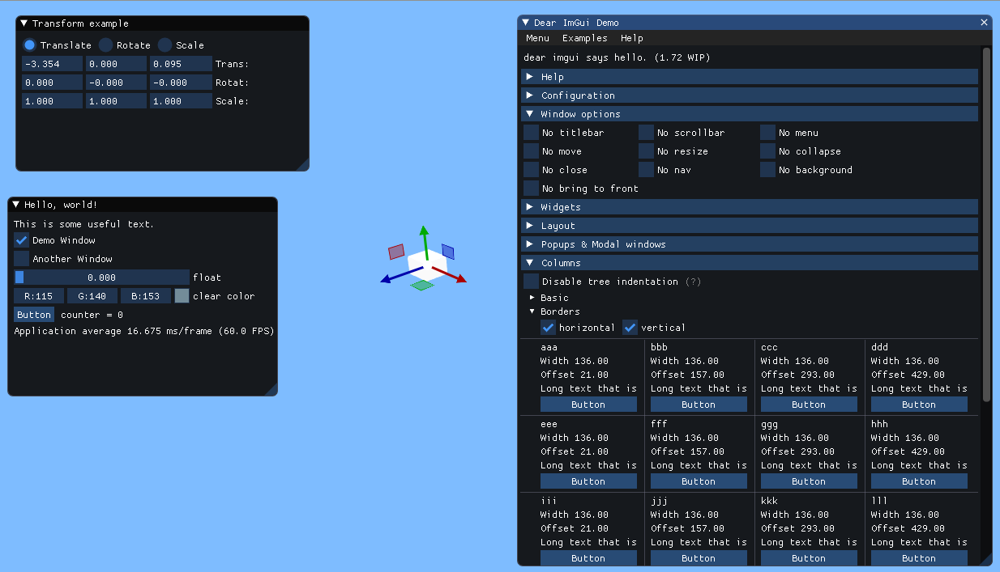

# Bsf Imgui Plugin

A submodule plugin of the bsf library. It's meant to be built as a cmake
dependency of bsf. It is meant for fast prototyping of editor features and
gamedev tools. It is not meant to be used as an in-game UI or as a replacement
for the bsf gui library. While imgui has low overhead and a simple api, it's
not meant for more complex guis. Need to have a custom scene editor? Yes use
imgui. Need to render out a 3d interface for your spaceship cockpit? Don't use
imgui. More thoughts can be found on this
[gist](https://gist.github.com/bkaradzic/853fd21a15542e0ec96f7268150f1b62).

# Features

* Implements [imgui](https://github.com/ocornut/imgui/) library for fast dev prototyping
* Integrates with [ImGuizmo](https://github.com/CedricGuillemet/ImGuizmo)
  library for 3d gizmo editing of bsf scene objects.
* Renders on core thread while the imgui interface can be built on the
  simulation thread

# TODO

* try out imgui docking branch demo
* add useful widgets and bsf utilities to the repository as the plugin is
  adopted and used.